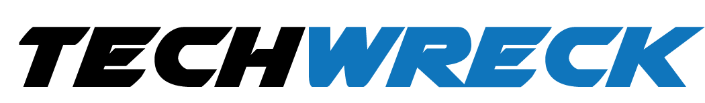
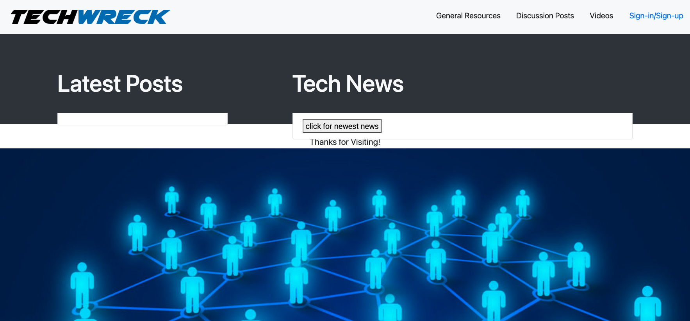

# RESOURCE BLOG FOR JUNIOR DEVELOPERS

> 

### Project's Title
> The name of the project is TECHWRECK.

### MOTIVATION BEHIND THIS PROJECT
> The motivation to build this project was to help junior web developers with development resources which they can find in this website as well as share their tech world experiences. They can also share issues and provide feedback which can be helpful to other junior web developers. This is a school project which also enhances our FRONTEND as well as our BACKENF skills.

### WHAT ISSUE DO WE SOLVE
> The biggest problem this website solves is it is going to save lot of time for beginners or junior webdeveloper searching for the right content this website should be one stop shop for discussing issues as well solving issues through articles, videos, ad discussion posts.

> As a web developer the biggest thing which we learn was to connect frontend and backend with using controllers

> Our project is going to be to go website for the people who are beginners in computer science as well it would be to go resource website for discussions and post related to web development.

> There several features to our website but one of the main feature which i would like to to focus is DISCUSSION POSTS, this section would be useful to every Junior Developer who can come and share their experiences as well as issues they've faced while traversing the tech world.

> The biggest challenge we faced in this project was to connect everything using MODEL VIEW CONTROLLER. 

### Project Description
> This project is all about sharing your experience and also browsing for the right content when it's needed, eveybody can share their projects, issues, concerns and all the other developers can participate and share their experience too.

### Technologies Used
> There were several technologies used to accomplish this project as stated below:

- "bcrypt": "^5.1.0",
- "connect-session-sequelize": "^7.1.5",
- "dotenv": "^16.0.3",
- "express": "^4.18.2",
- "express-handlebars": "^6.0.6",
- "express-session": "^1.17.3",
- "handlebars": "^4.7.7",
- "inquirer": "^9.1.4",
- "mysql2": "^2.3.3",
- "nodemon": "^2.0.20",
- "sequelize": "^6.25.3",
- "uniqid": "^5.4.0"

### How to Install and Run the Project
> There would be couple of dependencies you would have to download.
You would also need VSCODE, INSOMNIA.

### How to Use the Project
> You can simply download all the dependencies from our package.json, view our github repository, and clone it to your local computer to use on your local computer.

### Include Credits
> There were group of 4 people who collobrated on this project. You can also view our repository and contact us on:
- [NORDLEEN DE FRIAS](https://github.com/NDF-WEB-DEV)
- [SHULMEN BRETT](https://github.com/Wakasagi-Burt)
- [ALAN JOSE](https://github.com/Alanjose23)
- [HIREN PATEL](https://github.com/radhashyamsundardas)

### LIVE LINK AND GITHUB REPOSITORY
- [Link to repo](https://github.com/Wakasagi-Burt/resource-blog)
- [Link to Heroku](https://techwreckblog.herokuapp.com/)

### WEBSITE VIEW
> 

